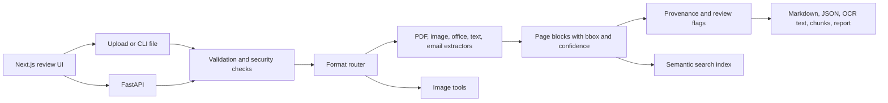

# SYNOPSIZE

SYNOPSIZE extracts searchable, page-aware content from business documents. The
backend exposes the asynchronous API used by the Next.js review UI and a local
CLI for producing portable JSON, Markdown, OCR text, semantic chunks, and a
processing report.

## Architecture



The backend is in `backend/app`: `core/file_parser.py` routes formats,
`core/extractors/` contains format-specific parsers, `core/output.py` adds the
common provenance schema, and `app/cli.py` writes command-line outputs. The
frontend is in `frontend/src`.

## Setup and run

From the repository root in PowerShell:

```powershell
.\venv\Scripts\python.exe -m pip install -r backend\requirements.txt
Set-Location backend
..\venv\Scripts\python.exe -m uvicorn app.main:app --reload
```

Image OCR also requires the Tesseract executable. On Windows, install it with:

```powershell
winget install --id UB-Mannheim.TesseractOCR --exact --source winget
```

Restart the backend after installation. The image extractor searches `PATH` and
the standard `Program Files\Tesseract-OCR` installation location.

The API is available at `http://127.0.0.1:8000` and its OpenAPI page at
`http://127.0.0.1:8000/docs`.

To run the CLI from `backend`:

```powershell
..\venv\Scripts\python.exe -m app.cli .\sample.pdf --out .\output
..\venv\Scripts\python.exe -m app.cli .\sample.eml --out .\mail-output --no-embeddings
```

The output directory contains `result.json`, `result.md`, `ocr.txt`,
`chunks.jsonl`, `report.json`, and a `figures/` directory. Every emitted block
includes page, bbox, confidence, extractor, routing, flags, and file-hash
provenance. Use `--config` to select a YAML config file; the default is
`backend/config.yaml`.

Successful API and CLI parses are appended to `backend/storage/audit.jsonl` as
hash-linked records. `GET /api/audit` verifies the chain; add `?format=csv` to
export it. The API removes expired uploads, job results, and tool outputs at
startup and hourly, using the configured retention period. Correction and audit
records are retained separately.

For the UI, install the frontend dependencies in `frontend` and run
`npm run dev`. The API base URL currently defaults to `http://127.0.0.1:8000`.

## Format support and limits

The router handles PDF; PNG/JPEG/TIFF/HEIC; DOCX/PPTX/XLSX/CSV; HTML, Markdown,
TXT, RTF and EML. PPTX speaker notes, spreadsheet hidden-sheet visibility and
formula/cached-value pairs are retained. EML attachments are recursively
parsed subject to the configured depth and cumulative-size limits. MSG uses
`extract-msg`. Legacy DOC/PPT/XLS files require LibreOffice (`soffice`) on
`PATH` for conversion.

`backend/config.yaml` centralizes upload size, page count, image pixels,
archive expansion, attachment depth/size, retention, confidence thresholds,
CORS origins, rate limits and the legacy converter timeout. The API and CLI
use the configured upload size; PDF/image validation enforces page and pixel
limits, email parsing enforces attachment limits, and legacy conversion has a
timeout. File validation checks extension/signature, size, document integrity, suspicious
OOXML relationships/macros, and PDF active-action markers. This is not a
substitute for an antivirus engine or process-level memory isolation.

Run backend regression tests from `backend`:

```powershell
..\venv\Scripts\python.exe -m pytest tests -q
```
